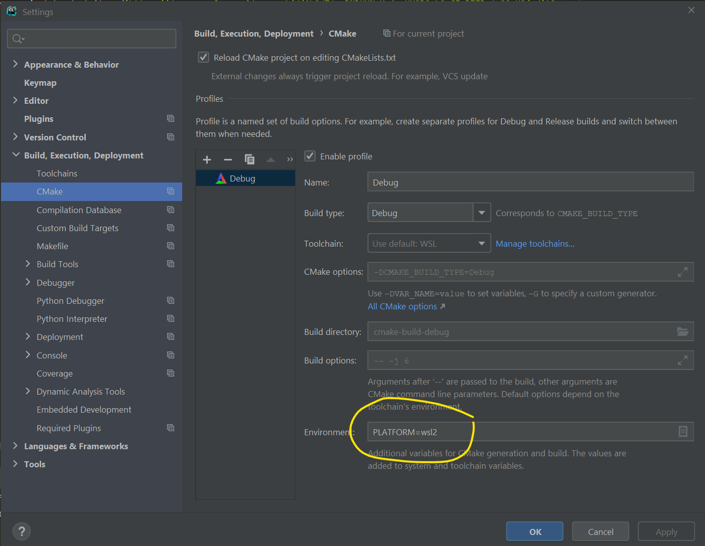

# Spring 2022 - PA03 - Mystery Sort

- See the project handout [here](https://docs.google.com/document/d/1SS2lFwg4KvXdXyJ9enunNQ2mpQdE2wsRO_24U0YjmGc/edit?usp=sharing)

## Important

In order for the project to link against the correct version of the mystery_sorter library, you need to set
a CMAKE environment variable.  To do this, Choose **Settings** from the File Menu.  In the left-side tree, 
choose **Build, Execution, Deployment** > **CMake**.  In the **Environment** field (circled in yellow in the 
screencap below), add `PLATFORM=wsl2` if you're on Windows using WSL.  If you're on a mac, add `PLATFORM=mac`.  

- The `include` directory contains a .h file with 5 mystery sort algorithm function declarations
- The `lib` folder contains a static link library that has the implementations of those 5 sorts. There's a version for WSL and a version for mac. 

